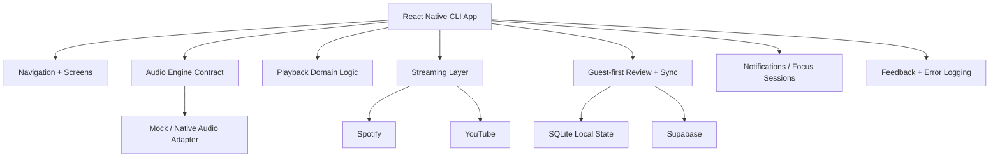

# GenkiSound

A mobile music product focused on mood-based playback, safe audio modulation, streaming integrations, and music-learning interactions.

> This public repository is a product showcase. The production codebase is private.  
> This repo focuses on product scope, architecture, technical decisions, and delivery direction.

## Overview

GenkiSound explores a specific product idea: helping users interact with music through mood-based playback controls and learning-oriented experiences without turning audio manipulation into a gimmick.

The product began around a focused playback concept:

- adjust a track toward a more relaxed or more energetic feel
- keep tempo and pitch changes inside safe ranges
- make playback controls understandable and predictable
- support a path toward richer music-learning flows

The product also expanded into:

- streaming-provider integrations
- lyrics-first learning surfaces
- guest-first review and sync flows
- feedback and account tooling
- focus-session support

## What makes it different

- **Mood-based playback** instead of generic equalizer-style controls
- **Safe tempo and pitch modulation** with explicit quality boundaries
- **Music-learning interactions** layered into the playback product
- **Guest-first architecture** instead of hard login gating
- **Streaming-aware design** across Spotify and YouTube paths
- **Native-first audio direction** for long-term DSP flexibility

## Product Areas

- Mood presets
- Manual tempo and pitch controls
- Playback queue and transport controls
- Streaming screen and provider switching
- Lyrics-first learning and review handoff
- Guest-first account and sync foundation
- Focus timer / session support
- Feedback and error-log support

## Demo Assets

### Screenshots
Screenshots will be added later.

Recommended file names:

- `assets/screenshots/home.png`
- `assets/screenshots/player.png`
- `assets/screenshots/streamings.png`
- `assets/screenshots/music-learning.png`
- `assets/screenshots/review-hub.png`
- `assets/screenshots/config.png`

### Navigation GIF
A navigation GIF will be added later.

Recommended file name:

- `assets/gifs/genkisound-navigation.gif`

## Simple Architecture Diagram

## Documentation

- [Architecture Summary](docs/architecture.md)
- [Technical Decisions](docs/technical-decisions.md)
- [Roadmap](docs/roadmap.md)
- [Changelog](docs/changelog.md)

## Why this repository is public

This repository exists to present the product direction, engineering thinking, and system design behind GenkiSound without exposing the private production codebase.

It is intended to show:

- product exploration quality
- architecture choices
- native/mobile engineering depth
- integration complexity
- thoughtful trade-offs around audio and platform work

## Contact

If you are a recruiter, collaborator, or hiring manager and want to discuss the project, feel free to reach out through my GitHub or LinkedIn profile.
